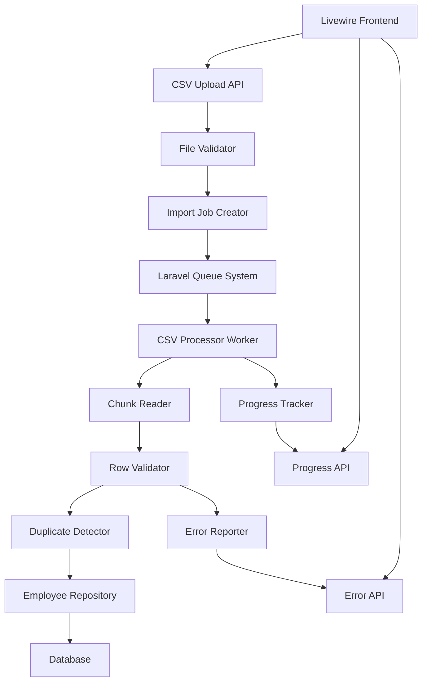

# Design Document

## Overview

The Employee Import System is designed as a scalable, fault-tolerant backend service built with Laravel and Livewire. The system processes employee CSV and Excel file uploads asynchronously using Laravel's queue system, provides real-time progress tracking, and ensures data integrity through idempotent operations.

**Dependencies**: The system requires PhpSpreadsheet library for Excel file processing alongside Laravel's built-in CSV handling capabilities.

The architecture follows a modular approach with clear separation of concerns, enabling efficient processing of large files while maintaining system responsiveness and reliability.

## Architecture

### High-Level Architecture



### Processing Flow

1. **Upload Phase**: File validation and job creation
2. **Queue Phase**: Asynchronous job dispatching
3. **Processing Phase**: Chunked CSV processing with validation
4. **Tracking Phase**: Real-time progress and error reporting
5. **Completion Phase**: Final status and summary reporting

## Components and Interfaces

### 1. File Upload Controller

**Responsibility**: Handle CSV and Excel file uploads and initial validation

```php
class EmployeeImportController extends Controller
{
    public function upload(Request $request): JsonResponse
    public function getProgress(string $importId): JsonResponse
    public function getErrors(string $importId): JsonResponse
}
```

**Key Features**:
- File size and type validation (max 20MB, CSV and Excel formats)
- Header validation against expected employee schema
- Import job creation and queue dispatching
- RESTful API responses with proper error handling
- Support for .csv, .xlsx, and .xls file formats

### 2. Import Job Model

**Responsibility**: Track import job state and metadata

```php
class ImportJob extends Model
{
    // Status: pending, processing, completed, failed
    protected $fillable = [
        'filename', 'file_path', 'status', 'total_rows', 
        'processed_rows', 'successful_rows', 'error_rows',
        'started_at', 'completed_at', 'last_processed_row'
    ];
}
```

### 3. File Processing Job

**Responsibility**: Asynchronous CSV and Excel file processing

```php
class ProcessEmployeeImportJob implements ShouldQueue
{
    use Dispatchable, InteractsWithQueue, Queueable, SerializesModels;
    
    public function handle(FileProcessorService $processor): void
    public function failed(Throwable $exception): void
}
```

**Key Features**:
- Chunked processing to manage memory usage
- Support for both CSV and Excel file formats
- Progress tracking during processing
- Failure handling and retry logic
- Resumable processing from last checkpoint

### 4. File Processor Service

**Responsibility**: Core CSV and Excel processing logic

```php
class FileProcessorService
{
    public function processImport(ImportJob $job): void
    private function processChunk(array $rows, ImportJob $job): void
    private function validateAndProcessRow(array $row, int $rowNumber, ImportJob $job): void
    private function detectFileType(string $filePath): string
    private function readCsvFile(string $filePath): Generator
    private function readExcelFile(string $filePath): Generator
}
```

**Key Features**:
- Stream-based reading for both CSV and Excel files for memory efficiency
- Automatic file type detection based on extension
- Configurable chunk size (default: 100 rows)
- Row-by-row validation and processing
- Duplicate detection within file scope
- Uses PhpSpreadsheet for Excel file processing

### 5. Employee Validator

**Responsibility**: Validate individual employee records

```php
class EmployeeValidator
{
    public function validate(array $data): ValidationResult
    private function validateRequired(array $data): array
    private function validateEmail(string $email): bool
    private function validateEmployeeNumber(string $number): bool
    private function validateSalary(mixed $salary): bool
    private function validateCurrency(string $currency): bool
    private function validateDates(array $data): array
}
```

**Validation Rules**:
- Required fields: employee_number, first_name, last_name, email
- Email format validation (must contain @ and valid domain)
- Employee number uniqueness and reasonable length limits
- Positive salary values (numeric only, no text like "50k")
- Valid currency codes: KES, USD, ZAR, NGN, GHS, UGX, RWF, TZS
- Valid country codes: KE, NG, GH, UG, ZA, TZ, RW
- Date format validation (YYYY-MM-DD, no future dates for start_date)
- Department name length limits (reasonable business names only)

### 6. Employee Repository

**Responsibility**: Database operations for employee records

```php
class EmployeeRepository
{
    public function findByEmployeeNumber(string $number): ?Employee
    public function findByEmail(string $email): ?Employee
    public function createOrUpdate(array $data): Employee
    public function checkDuplicate(string $employeeNumber, string $email): ?Employee
}
```

**Key Features**:
- Idempotent upsert operations
- Efficient duplicate checking
- Optimized database queries with proper indexing

### 7. Progress Tracker

**Responsibility**: Real-time progress monitoring

```php
class ProgressTracker
{
    public function updateProgress(ImportJob $job, int $processedRows): void
    public function getProgress(string $importId): array
    public function markRowProcessed(ImportJob $job, bool $success): void
}
```

**Metrics Tracked**:
- Total rows in file
- Processed rows count
- Successful imports count
- Error/skipped rows count
- Processing percentage
- Estimated completion time

### 8. Error Reporter

**Responsibility**: Error tracking and reporting

```php
class ErrorReporter
{
    public function recordError(ImportJob $job, int $rowNumber, string $type, string $message, array $data = []): void
    public function getErrors(string $importId, array $filters = []): Collection
    public function getErrorSummary(string $importId): array
}
```

**Error Categories**:
- Validation errors (missing fields, format issues)
- Duplicate errors (within file duplicates)
- Business rule violations
- System errors (database failures)

## Data Models

### Employee Model

```php
class Employee extends Model
{
    protected $fillable = [
        'employee_number', 'first_name', 'last_name', 'email',
        'department', 'salary', 'currency', 'country_code', 'start_date'
    ];
    
    protected $casts = [
        'start_date' => 'date',
        'salary' => 'decimal:2'
    ];
}
```

**Database Indexes**:
- Unique index on `employee_number`
- Unique index on `email`
- Composite index on `(employee_number, email)` for duplicate checking

### Import Error Model

```php
class ImportError extends Model
{
    protected $fillable = [
        'import_job_id', 'row_number', 'error_type', 
        'error_message', 'row_data'
    ];
    
    protected $casts = [
        'row_data' => 'array'
    ];
}
```

### Database Schema

```sql
-- employees table
CREATE TABLE employees (
    id BIGINT UNSIGNED AUTO_INCREMENT PRIMARY KEY,
    employee_number VARCHAR(50) UNIQUE NOT NULL,
    first_name VARCHAR(100) NOT NULL,
    last_name VARCHAR(100) NOT NULL,
    email VARCHAR(255) UNIQUE NOT NULL,
    department VARCHAR(100),
    salary DECIMAL(12,2),
    currency VARCHAR(3),
    country_code VARCHAR(2),
    start_date DATE,
    created_at TIMESTAMP NULL,
    updated_at TIMESTAMP NULL,
    INDEX idx_employee_lookup (employee_number, email),
    INDEX idx_currency (currency),
    INDEX idx_country (country_code)
);

-- import_jobs table
CREATE TABLE import_jobs (
    id CHAR(36) PRIMARY KEY,
    filename VARCHAR(255) NOT NULL,
    file_path VARCHAR(500) NOT NULL,
    status ENUM('pending', 'processing', 'completed', 'failed') DEFAULT 'pending',
    total_rows INT UNSIGNED DEFAULT 0,
    processed_rows INT UNSIGNED DEFAULT 0,
    successful_rows INT UNSIGNED DEFAULT 0,
    error_rows INT UNSIGNED DEFAULT 0,
    last_processed_row INT UNSIGNED DEFAULT 0,
    started_at TIMESTAMP NULL,
    completed_at TIMESTAMP NULL,
    created_at TIMESTAMP NULL,
    updated_at TIMESTAMP NULL
);

-- import_errors table
CREATE TABLE import_errors (
    id BIGINT UNSIGNED AUTO_INCREMENT PRIMARY KEY,
    import_job_id CHAR(36) NOT NULL,
    row_number INT UNSIGNED NOT NULL,
    error_type VARCHAR(50) NOT NULL,
    error_message TEXT NOT NULL,
    row_data JSON,
    created_at TIMESTAMP NULL,
    FOREIGN KEY (import_job_id) REFERENCES import_jobs(id) ON DELETE CASCADE,
    INDEX idx_import_errors (import_job_id, error_type)
);
```

## Error Handling

### Error Categories and Responses

1. **File Validation Errors**
   - Invalid file format → HTTP 422 with specific message
   - File too large → HTTP 413 with size limit information
   - Missing headers → HTTP 422 with expected header list

2. **Row Validation Errors**
   - Missing required fields → Skip row, log error
   - Invalid email format → Skip row, log error
   - Duplicate employee_number/email → Skip row, log error
   - Invalid data types → Skip row, log error

3. **System Errors**
   - Database connection failures → Retry job with exponential backoff
   - File system errors → Fail job with detailed error message
   - Memory exhaustion → Reduce chunk size and retry

### Error Recovery Strategies

- **Transient Errors**: Automatic retry with exponential backoff (max 3 attempts)
- **Validation Errors**: Skip row and continue processing
- **Critical Errors**: Fail job and require manual intervention
- **Partial Failures**: Resume from last successful checkpoint

## Testing Strategy

### Unit Tests

1. **Validator Tests**
   - Test all validation rules with valid and invalid data
   - Test edge cases (empty strings, null values, boundary conditions)
   - Test email format validation with various formats

2. **Repository Tests**
   - Test CRUD operations for employees
   - Test duplicate detection logic
   - Test upsert functionality with existing records

3. **Service Tests**
   - Test CSV processing with various file formats
   - Test chunk processing logic
   - Test progress tracking accuracy

### Integration Tests

1. **API Endpoint Tests**
   - Test file upload with valid and invalid files
   - Test progress tracking API responses
   - Test error reporting API functionality

2. **Queue Job Tests**
   - Test job processing with sample CSV files
   - Test job failure and retry scenarios
   - Test resumable processing after interruption

3. **Database Tests**
   - Test data integrity during concurrent imports
   - Test performance with large datasets
   - Test idempotency with duplicate job executions

### Performance Tests

1. **Load Testing**
   - Test with 50,000 row CSV files
   - Test concurrent import jobs
   - Test memory usage during large file processing

2. **Stress Testing**
   - Test system behavior under resource constraints
   - Test queue worker performance under load
   - Test database performance with large datasets

### Test Data

1. **Valid CSV Samples**
   - good-employees.csv (20,000+ rows) with clean employee data for performance testing
   - Various departments: Engineering, Finance, Sales, Support, etc.
   - Multiple currencies: KES, USD, ZAR, NGN, GHS, UGX, RWF, TZS
   - Multiple countries: KE, NG, GH, UG, ZA, TZ, RW

2. **Invalid CSV Samples**
   - bad-employees.csv (20 rows) with intentional validation errors:
     - Missing required fields (empty employee_number, missing email)
     - Invalid email formats (missing @, incomplete domains)
     - Invalid salary formats (negative values, text like "50k", "66.5k")
     - Invalid currency codes (AAA)
     - Invalid country codes (XX)
     - Invalid date formats (15-2021-01, future dates like 2026-01-15, 2030-03-03)
     - Duplicate employee numbers within file
     - Extremely long field values
     - Department names exceeding reasonable limits

## Performance Considerations

### Memory Management

- **Streaming File Reader**: Process CSV and Excel files without loading entire content into memory
- **Chunked Processing**: Process files in configurable chunks (default: 100 rows)
- **Memory Monitoring**: Track memory usage and adjust chunk size dynamically
- **Excel Optimization**: Use PhpSpreadsheet's streaming reader for large Excel files

### Database Optimization

- **Proper Indexing**: Unique indexes on employee_number and email for fast lookups
- **Batch Operations**: Use database transactions for chunk processing
- **Connection Pooling**: Optimize database connections for queue workers

### Queue Configuration

- **Worker Scaling**: Configure multiple queue workers for parallel processing
- **Job Prioritization**: Prioritize smaller files for faster user feedback
- **Timeout Management**: Set appropriate timeouts for large file processing

### Caching Strategy

- **Progress Caching**: Cache progress data in Redis for fast API responses
- **Validation Caching**: Cache validation results for duplicate detection
- **File Metadata Caching**: Cache file information for resume operations